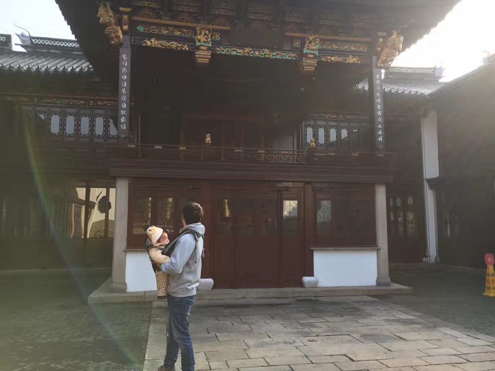

## 关于我
送大伙一副苏州「全晋会馆」戏台对子，人生tm就是一台戏！

**普天同庆： 装谁像谁谁装谁谁就像谁, 看我非我我看我我也非我.** 

Jack IDaaS（身份即服务） 行业创业者，2016年创立 freeCodeCamp.cn 中文社区，是一位在开发者生态领域投入多年的连续创业者，曾是一名编程老师，也是开发者社区运营专家。拥有5年的开发者社区运营经验，将近4年的创业经验，3年的嵌入式 Linux C 开发和教育经验，2年的Android 编程教育经验，2年的区块链从业经历。2014年，加入 GDG Suzhou 并成为组织者，受邀参加 Google I/O 2015大会。他对「开发者关系」在中国的状况有自己独到的理解，Jack 对「开源软件运动与开发者关系」有着赤诚的热情❤️

由于 Jack 在编程教育领域创造了广泛的社会影响力，帮助了中国45万人免费学习编程，数百人第一次拿到Web工程师Offer，2017年，入选了[「福布斯中国30位30岁以下杰出青年」社会企业榜单](http://china.forbeschina.com/review/list/002390.shtml)；并入选了[达沃斯(世界经济论坛)全球杰出青年](https://www.globalshapers.org)。

## About me
Jack is the founder of the freeCodeCamp.cn Chinese community, which have 20+ city hubs and more than 450,000 users . He is a serial entrepreneur who has been involved in the developer's ecology for many years. He was a programming teacher and a developer community operation expert. 5 years of experience in developer community operations, nearly 4 years of entrepreneurial experience, 3 years of embedded Linux C development and education experience, 2 years of Android programming education, 2 years of blockchain experience. In 2014, he joined GDG Suzhou and became an organizer. He was invited to participate in the Google I/O 2015 conference. He has his own unique understanding of DevRel in China. he has a great passion for "open source software movement and DevRel".

Because Jack has created a wide range of social influence in the field of programming education, it helped 450,000 people in China to learn programming free of charge. Hundreds of people got the Web Engineer Offer for the first time. In 2017, Jack was selected as "Forbes China 30 Under 30" list of social enterprises and joined the Global Shaper Community of Davos (World Economic Forum)

* [猿生态 DevEco](https://deveco.io)
* [FCC中国](https://freeCodeCamp.cn)
* [中国开发者关系大会](https://DevRel.cn)
